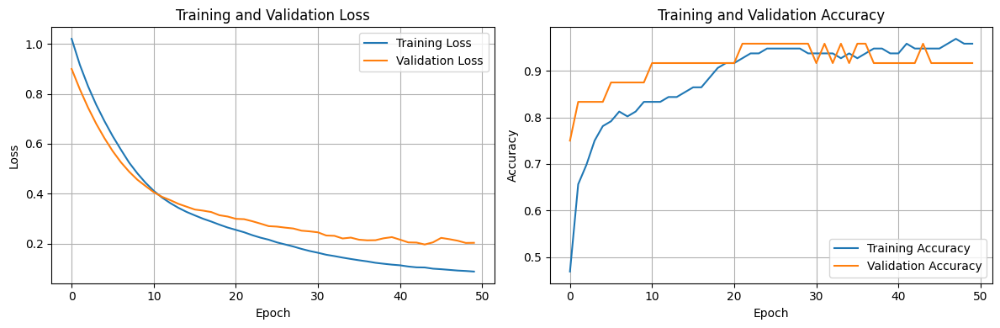
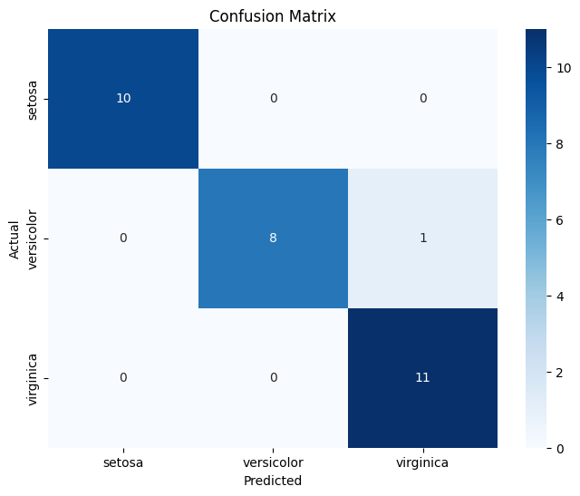

# Classification of Iris Species Using a Deep Neural Network with TensorFlow

This project demonstrates how to classify Iris flower species using a deep neural network (DNN) built with TensorFlow. It serves as an introductory machine learning project for beginners interested in deep learning and data science.

## Dataset
The Iris dataset is a classic dataset in machine learning, containing 150 samples from three species:
- Setosa
- Versicolor
- Virginica

Each sample includes:
- Sepal Length
- Sepal Width
- Petal Length
- Petal Width

## Model
The model uses a simple feed-forward neural network with:
- Input layer for four features
- One or more hidden layers
- Output layer with softmax activation (3 units for 3 species)

## Libraries Used
- TensorFlow
- NumPy
- Matplotlib
- Scikit-learn

## Features
- Preprocessing of the Iris dataset
- Training and evaluation of a DNN
- Visualizations of performance metrics

## Visualizations
### Accuracy over Epochs


### Confusion Matrix


## How to Run
```bash
pip install -r requirements.txt
python iris_dnn_classifier.py
```

## Results
The model achieves high accuracy and demonstrates effective classification of species based on floral features.
